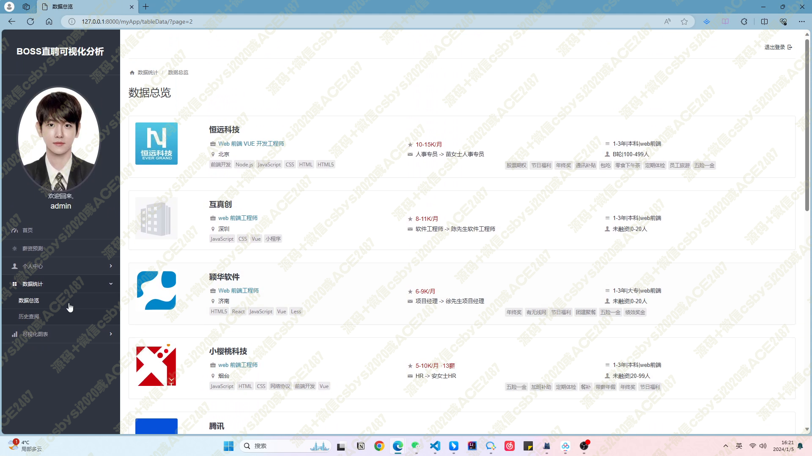

# 039 BOSS 直聘数据分析及薪资预测系统-设计展示

> **代码有偿获取 可接受定制 微信联系方式: csbysj2020 或 ACE2487，备注(BS)**

> 

> 

## 项目介绍：

BOSS 直聘数据分析及薪资预测系统是一个旨在为求职者和企业提供全面、准确的职位信息和薪资预测的人才市场数据分析平台。通过对 BOSS 直聘网站上的招聘信息进行数据采集、处理和分析，该系统能够帮助用户更好地了解市场需求、制定求职计划，并为企业提供准确的人才需求分析，为人才招聘提供参考。

## 实现：

该系统使用 Python 作为主要编程语言，选择 Django 作为 Web 框架来构建整个系统。数据存储方面，我们使用 MySQL 数据库来存储职位信息数据和用户信息数据。为了实现数据可视化，系统采用了 Echarts 和 Matplotlib 等技术来呈现数据分析结果。同时，为了提高数据处理效率，我们使用 Pandas 库进行数据清洗、去重和格式化操作，并使用 Jieba 进行中文分词处理。此外，为了实现薪资预测功能，我们使用 Scikit-learn 库建立了线性回归模型。

在前端方面，系统采用了 Bootstrap 框架来实现响应式设计，使得界面能够适配不同设备的屏幕大小，并使用 jQuery 和 Ajax 来实现交互逻辑。为了实现数据的定时爬取，我们使用 Selenium 作为爬虫工具，通过模拟浏览器操作来获取 BOSS 直聘网站上的职位信息。

## 技术栈：

1. 编程语言：Python
2. Web 框架：Django
3. 数据库：MySQL
4. 数据可视化：Echarts、Matplotlib
5. 数据处理：Pandas、Jieba
6. 模型预测：Scikit-learn
7. 前端开发：Bootstrap、jQuery、Ajax
8. 爬虫：Selenium

该系统包括用户管理模块、数据采集模块、数据处理模块、数据分析模块和系统安全模块。用户可以通过系统进行注册、登录和修改个人信息等操作。数据采集模块能够定时爬取 BOSS 直聘网站上的职位信息，并将其存储到 MySQL 数据库中。数据处理模块对采集到的数据进行清洗、去重和格式化处理，以便后续的数据分析操作。数据分析模块根据用户需求，对数据进行统计、可视化展示和薪资预测，提供学历饼状图、数据获取时间柱状图、职位信息列表、薪资预测等功能。系统安全模块保证用户信息和系统数据的安全性，防止未经授权的访问和恶意攻击。

## 总结：

BOSS 直聘数据分析及薪资预测系统是一个基于 Python Django、Echarts 等技术栈开发的人才市场数据分析平台。通过数据采集、处理和分析，该系统为用户提供全面、准确的职位信息和薪资预测，帮助求职者了解市场需求，制定求职计划，并为企业提供人才需求分析参考。同时，系统采用了 MySQL 数据库存储数据，使用 Echarts 和 Matplotlib 实现数据可视化，利用 Pandas 和 Jieba 进行数据处理，结合 Scikit-learn 实现薪资预测模型建立。前端方面，系统运用了 Bootstrap、jQuery 和 Ajax 等技术，爬虫方面使用了 Selenium。通过这些技术和功能模块的配合，系统能够满足用户的各种需求，并保证用户信息和系统数据的安全性。

## 视频

> **点击查看 \>\>\> [https://www.bilibili.com/video/BV11Q4y1L7gx/](https://www.bilibili.com/video/BV11Q4y1L7gx/)**

## 截图

